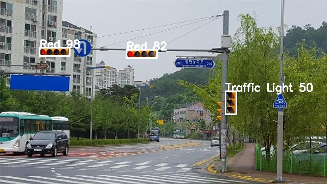

# 소개

 COCO Dataset으로 학습된 tensorflow의 object detection를 이용하여 이미지, 비디오에 있는 신호등을 검출  

#### 테스트 사진

 
   

# 파일 설명   

  ### object_detection.py 
  <h3> API load, inception V3를 이용한 전이 학습등 다양한 함수 모음 (실제 실행파일 X)    

  ### extract_traffic_lights.py 
  <h3> 이미지 내 신호등으로 인식된걸 잘라서 저장해준다    

  ### train_traffic_light_color.py
  <h3> inception V3 모델을 기반으로 전이학습을 시켜 초록색, 노란색, 빨간색, 신호등이 아닌것을 학습시킴    

  ### detect_traffic_light_color_img.py
  <h3> object detection과 학습된 인공지능을 기반으로 이미지 내 신호등을 찾아줌    

  ### detect_traffic_light_color_vid
  <h3> object detection과 학습된 인공지능을 기반으로 비디오 내 신호등을 찾아줌     

# 사용법 (사용 순서)
 traffic_light_input, traffic_light_cropped, test_images, traffic_light_dataset > (0_green, 1_yellow, 2_red, 3_not) 디렉토리를 만든다.  

1. 신호등이 있는 사진을 여러개 구한 후 traffic_light_input 디렉토리에 넣는다. 

2. extract_traffic_lights.py를 실행하면 traffic_light_cropped 디렉토리 내에 신호등으로 인식된 사진들이 들어가는데 모든 사진들을 색깔별로 0_green, 1_yellow, 2_red 폴더에 넣는다. (신호등이 아닌건 3_not 폴더에 넣음) 

3. train_traffic_light_color.py 실행하면 모델학습이 진행되며 학습이 끝나면 traffic.h5 파일이 나온다. 

4. 신호를 인식하기 위한 사진을 test_images 디렉토리에 넣고 detect_traffic_light_color_img.py 를 실행한다. (비디오파일도 동일) 

5. 완료가 되면 test_images 디렉토리에 저장된다.  

##### 출처
https://automaticaddison.com/how-to-detect-and-classify-traffic-lights/#Extract_Traffic_Lights_From_Images
